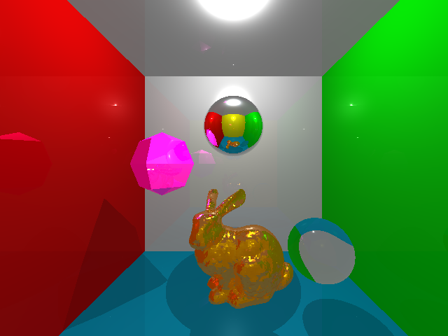

# ray-tracing
witted-style ray tracing, glsl language, written by python

### code list:
- `load_model.py`: lode bunny model
- `BVH.py`: use BVH tree to accelerate
- `whitted_style.py`: shading main code
- `whitted_style.vs`: vertex shader
- `whitted_style.vs`: fragment shader
